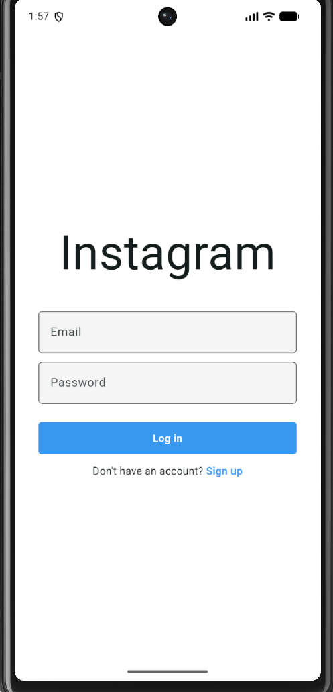
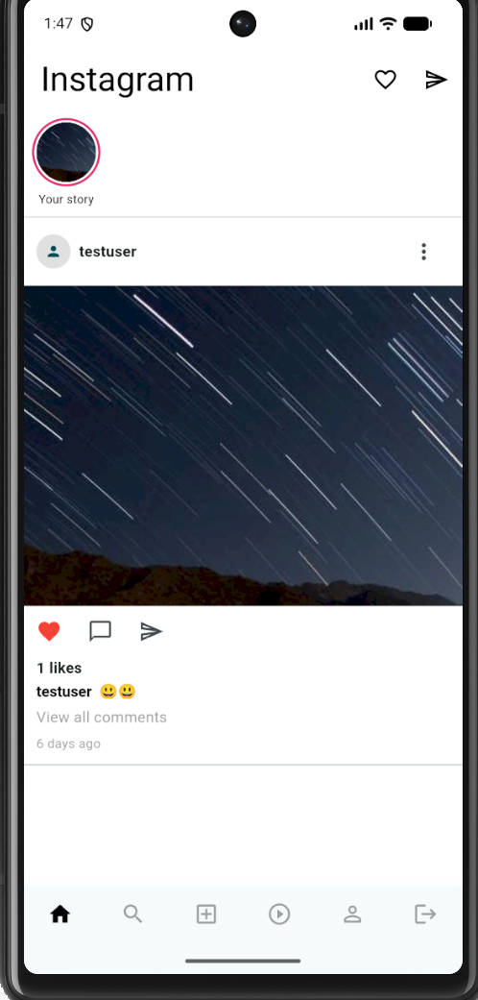
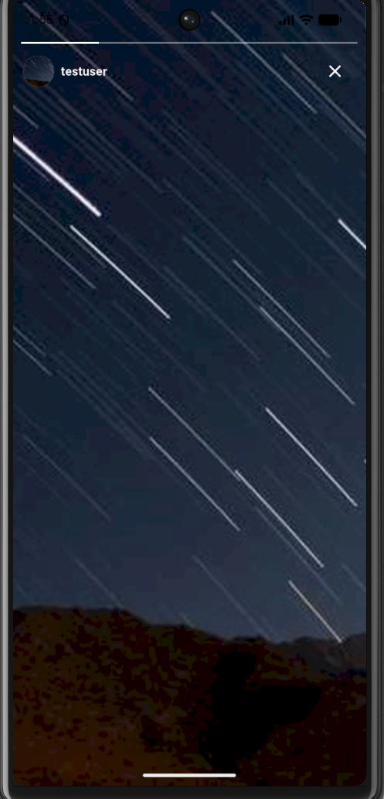
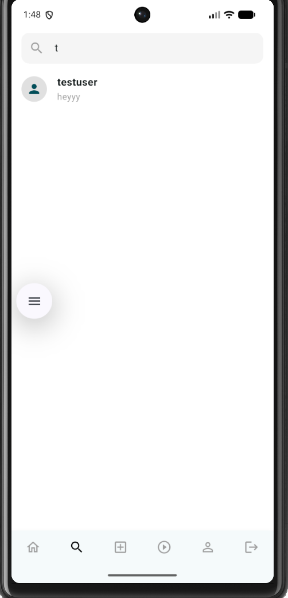
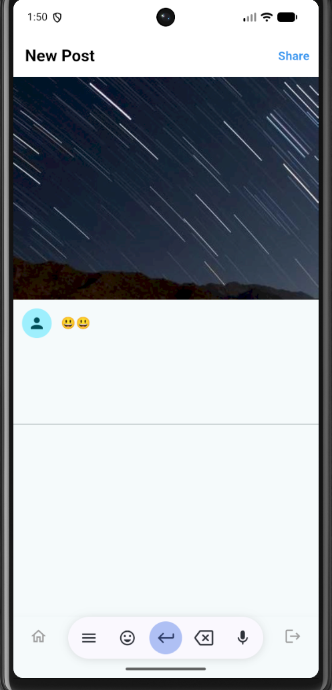
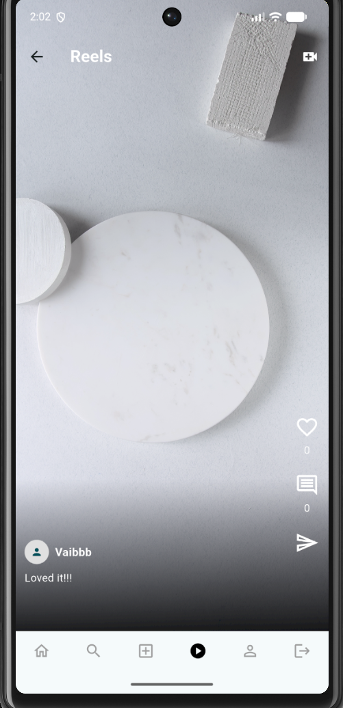
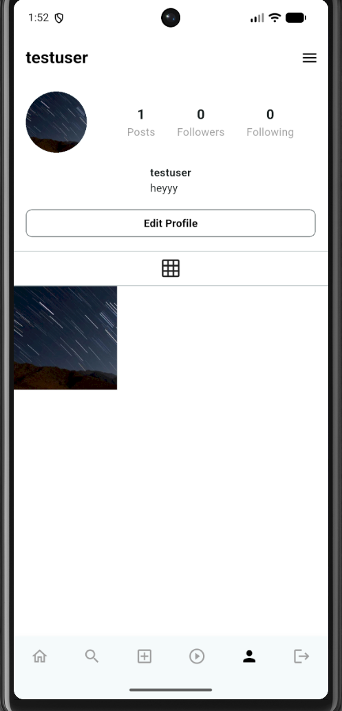
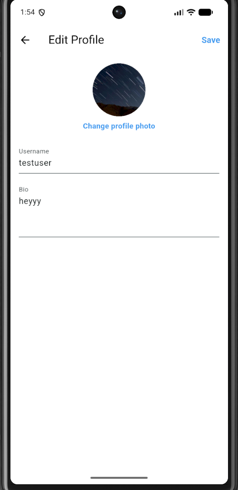

# 📸 Instagram Clone

<p align="center">
  <h3 align="center">A Full-Stack Instagram Clone built with Flutter & Firebase</h3>
  <p align="center">
    Experience real-time social networking with authentication, posts, stories, reels, likes, comments, search, follow system, and user profiles.
  </p>
</p>

---

## ✨ Features

### 🔐 Authentication
- Email & Password Sign Up
- Secure Login
- Firebase Authentication
- Persistent User Sessions

### 🏠 Home Feed
- Real-time feed updates
- Upload image posts
- Captions
- Like & Unlike posts
- Double-tap like support
- Delete own posts

### 📖 Stories
- Upload Stories
- 24-hour Story support
- Story Viewer
- Animated Progress Bar

### 🎬 Reels
- Vertical scrolling reels
- Video playback
- Like reels
- Responsive video player

### 💬 Comments
- Real-time comments
- View comments
- Firestore synchronization

### 👤 Profile
- Profile Picture
- Bio
- Posts Grid
- Followers & Following
- Edit Profile

### 🔍 Search
- Search users by username
- View user profiles

### 👥 Social Features
- Follow Users
- Unfollow Users

---

# 📱 Application Preview

| Login | Sign Up | Home Feed |
|:---:|:---:|:---:|
|  |  |  |

| Stories | Search | Create Post |
|:---:|:---:|:---:|
|  |  |  |

| Reels | Profile | Edit Profile |
|:---:|:---:|:---:|
|  |  |  |

---

# 🛠 Tech Stack

| Technology | Purpose |
|------------|---------|
| Flutter | Cross-platform Mobile Development |
| Dart | Programming Language |
| Firebase Authentication | User Authentication |
| Cloud Firestore | Real-time Database |
| Firebase Storage | Image & Video Storage |
| Provider | State Management |
| Image Picker | Image & Video Selection |
| Video Player | Reels Playback |

---

# 🏗 Architecture

```text
Flutter UI
      │
      ▼
Provider State Management
      │
      ▼
Firebase Authentication
      │
      ▼
Cloud Firestore
      │
      ▼
Firebase Storage
```

---

# 📂 Project Structure

```text
lib/
├── models/
├── providers/
├── screens/
├── widgets/
├── services/
├── resources/
├── utils/
└── main.dart
```

---

# 🚀 Getting Started

### Clone the Repository

```bash
git clone https://github.com/VaibhaviLokesh/instagram-clone.git
```

### Navigate to Project

```bash
cd instagram-clone
```

### Install Dependencies

```bash
flutter pub get
```

### Configure Firebase

- Create a Firebase Project
- Enable Authentication
- Enable Cloud Firestore
- Enable Firebase Storage
- Add your `google-services.json`

### Run the App

```bash
flutter run
```

---

# 🚀 Key Functionalities

- ✅ Firebase Authentication
- ✅ Real-time Firestore Database
- ✅ Firebase Storage Integration
- ✅ Stories Feature
- ✅ Reels Feature
- ✅ User Search
- ✅ Follow / Unfollow System
- ✅ Like & Comment System
- ✅ Edit Profile
- ✅ Responsive Flutter UI

---

# 🎯 Future Enhancements

- 💬 Direct Messaging
- 🔔 Push Notifications
- ❤️ Saved Posts
- 🌙 Dark Mode
- 📤 Share Posts
- 🤖 AI Caption Suggestions
- 📊 Analytics Dashboard

---

# 📚 Learning Outcomes

This project helped me gain practical experience in:

- Flutter App Development
- Firebase Authentication
- Firestore Database Design
- State Management using Provider
- CRUD Operations
- Real-time Data Synchronization
- Cloud Storage Integration
- Responsive Mobile UI Design

---

# 👩‍💻 Developer

**Vaibhavi L**

Electrical & Electronics Engineering

Nitte Meenakshi Institute of Technology

⭐ If you found this project interesting, consider giving it a star!
